This blog post was updated on **18 May 2026**.

## How to finish a Fastai Lesson step by step

### Keep going until you finish the course

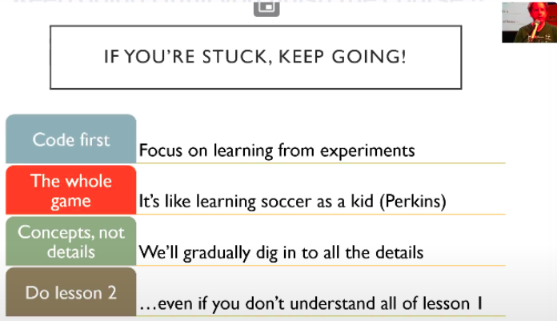

- You are not expected to remember everything. Yet.
- You are not expected to Understand everything. Yet.
- You are not expected to know Why everything works. Yet.
- Just be in situation where you can enter the code, run it, and something happening and you can start to experiment and get a feel for what's going on & then push on.
- **Look at the inputs, Look at the outputs. Experiment with Code.**

::: {.callout-tip collapse="false" icon=false}
## 👨‍💻 \ **Most of the successful Fastai students have watched the videos 3 times.**

Why multiple passes of fastai courses - will make you a world class Deep learning practitioner ?

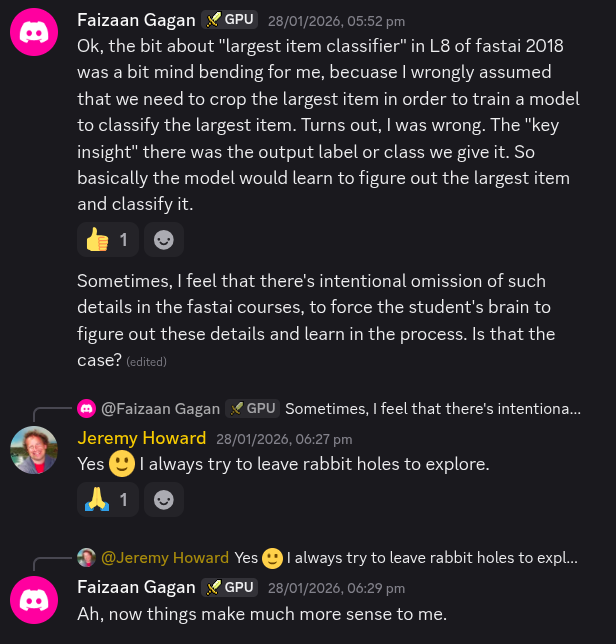

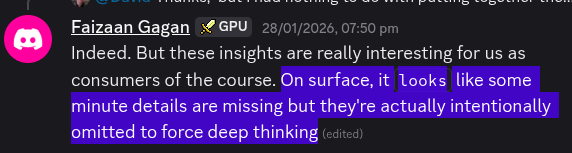

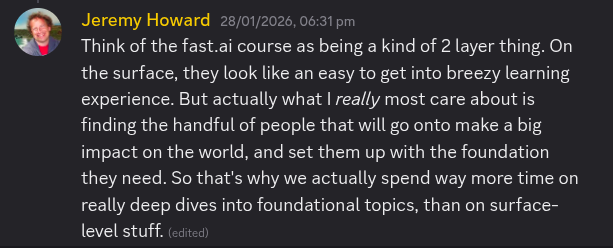

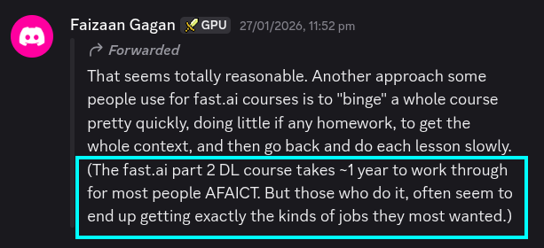

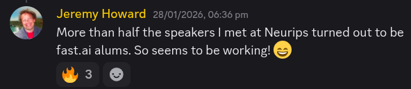

:::

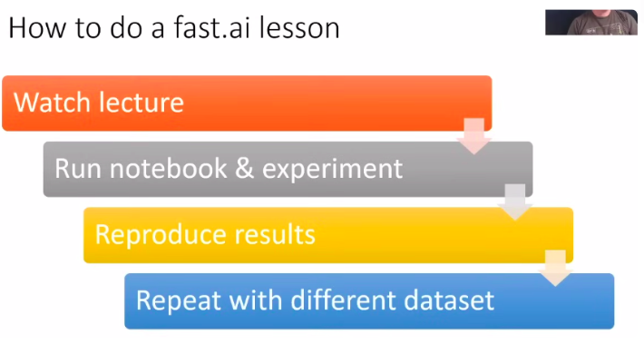

**1. Watch the lecture.**

- from start to finish without any coding, to get the big picture first.

**2. Open the lecture notebook and figure out how all the pieces fit together.The idea is to run each line of code and look at the outputs.**

- Ask yourself -
    - why is this cell here ?
    - what's it for ?
    - what's it gonna do ?
    - what's the input and output gonna look like ?

- If you come across a function you have not previously encountered, this is a good time to read its documentation.

- To start, Focus on what things Do ; Instead of what they are
    - Use doc(THING_I_WANT_TO_KNOW_MORE)
    - `doc(untar_data)`    <<  `from nbdev import show_doc as doc`
    - `?? untar_data`
    - `help(untar_data)`

- Add comments to the cell and explain what the cell does in your own words. If you do not understand, add a TODO on it.

- How will the performance differ if you pass in different arguments or slightly tweak the hyperparameters?

**3. Once you understand the bigger picture, it’s time to reproduce the results/notebook.**

- To do so, open a new notebook and try to recreate the training pipeline that the lecture demonstrated.

- It’s an open-book exercise – it’s okay if you need to look back at the lecture notebook, but the less you do so, the better.

    - If you get stuck at any point, you can refer to the class notebook. Find the solution to what you are stuck on. Look up the relevant documentation. Put the class notebook aside again, go back to your notebook, and try to code the solution.

    - If you are still stuck, you can refer to the class notebook again. Do not copy and paste the needed code. Instead, type it out yourself.

    - Check that it runs. If so, try changing the inputs, and see if that effects the outputs as you expect.

    - Any time that you feel unsure about why a particular step is being done, or how it works, or why the outputs are what you observe (or anything else), please ask on the forums.

- On the other hand, there are no limitations on reading the documentation or searching online. Both of these activities are encouraged and they closely resemble what programming feel like when it’s done completely on your own.

- Execute each cell and explain what the code cell is doing & why it is doing that in your own words.

- Any time that you feel unsure about why a particular step is being done, or how it works, or why the outputs are what you observe (or anything else), please ask on the forums.

- The test of whether you understand code is NOT to read it and think “yeah, that makes sense”.

- **The REAL test of whether you understand something is whether you can build it yourself.**

    - Recreating it from scratch , forces your brain to actively recall the info.

    - It forces you to think about what step to take next, which ensures that you’re thinking carefully about the “process”.

    - Through experimenting with inputs and outputs you build the intuitive understanding of the various components of a neural network that is critical to developing your expertise.

**4. Read the Fastbook chapter related to the course lesson.**

- First Read from start to finish without any coding, to get the big picture first.

- Second Read with retyping code & try to solve questionares.

**5. Create the notebook but use a different dataset**

**6. Watch the lecture again more slowly + Take notes**

- Like [Vishal Bakshi’s Notes](https://vishalbakshi.github.io/blog/posts/2024-07-14-practical-deep-learning-for-coders-part-1/){.underline} - Add ur learnings/todo/advice/homework etc to notes
- Finish the "Questionnaire" & "Further Research" this time.
- Finish Lesson Summary Questions.
- Finish aiquizzes
- Finish homeworks suggested by Jeremy, Radek.
- Finish relevant tutorials at fastai.docs (vision, datablock, learner ..etc)
- Read the Fastai forum related to Lesson.
- Ankify

> Essentially go through the notebooks and explore why what is doing what, play around with problem sets, and keep looking back at the original notebooks until it becomes fluid.

## Homework (in Fastai)

### 📝 Writing Blogs

- Write blogs geared towards those who either barely know what fastai is or are getting the basics to make sure I know it well enough and can explain it.

    - I found writing blogs have helped me figure out what’s the most important bits from lectures, the library, etc and also helps me to be able to explain it to others.

    - To add to this point, it doesn’t even have to be a full blog. When you run into an issue, write a forum post detailing the problem and what the solution is. This helps a ton not only for people that come after you on the forums, but will also help yourself. I have started creating these whenever I start to have a problem and usually I am able to find the solution, but if you aren’t able to, it also is a great way to help people follow how you arrived at the issue you are having.

### 🦆 Participate in Kaggle Competitions

- Even if you rank last in leaderboard - atleast come-up with end to end solution (i.e finish the competition).

- Learn a Lesson from Fastai and take a Kaggle competition based on the lesson. It will give you feedback on learning.

    - I would also add checking out the winning solutions on Kaggle. Some exercises I’ve enjoyed doing:

        - Annotating someone else’s kernel. Basically take their kernel and explain every line in markdown mode.

        - Taking a public Kaggle kernel model, studying it, and then try to replicate it as quickly as possible without referencing the original. The penalty for cheating is you have to restart the notebook from scratch.

    - Focus on different datasets and trying to get the best results on those datasets.  I am interested in X problems, so I find X datasets on Kaggle. And now there are a lot of Kaggle competitions going on as well.

### 🧩 Create a mini projects & use what you learnt.

- **Create terrible mini-projects. But build them. Later come back and refactor them.**

- Spend 1-2hrs a day on mini projects that I can get deep into for a month or two at most,

- Everyday, working 1-2 hrs on mini-projects, just exploring what some functions do, how they work, and applying it to any dataset I could find.

    - I’d explore pure pytorch code papers and try to migrate it to fastai.

    - Sometimes this is easy, eg the new optimizer LessW2020 got to work, where it’s a simple port of a function, other times it’s trying to pull full architectures from papers such as NTS-Net or Deep High Res. Again only working at most 2 hours a day so I don’t get too frustrated.

- Sometimes, instead of applying what I’ve just learned to another application, I try to implement some Fastai functions myself without using Fastai library.

    - To have a better understanding of what’s hapenning behind the curtain. Because when Jeremy explains it , it always seems brilliantly simple. But when you do it by yourself that’s another story. But be careful, hours pass quickly when doing this!

- **Make sure for every chapter of the Fastbook , you create some of kind of project** (however small or silly it is Or its a direct copy of something else you found)

- If you are low on inspiration :

    - Check out [Share you work](https://forums.fast.ai/t/share-your-work-here/27676) on fastai forum. There, you will find an assortment of ideas: blog posts, howtos, forum posts, GitHub repos, explainer videos, and Kaggle competitions.

    - Explore what some functions do, how they work, and applying it to any dataset I could find.

::: {.callout-note appearance="minimal"}

- **Don’t focus on the perfect learning thing. Focus on things that keeps you engaged.**

- Building something from scratch & putting it out in world and taking effective feedbacks from people.

- You are your own rival. Try to outperform yourself on your projects and you will see growth.

:::

### 💼 Finish a great project

- **Focus on making one really great project that is really polished , which shows off my skills.**

    - Jeremy says that so many people have many interesting but half-finished projects on github, and that it’s much better to have a single one that is really polished.

    - Polishing of really well means - to create really good documentation about it, really nice interface for it , make it as good as you can.

    - The project need not be world changing OR something which no one ever built. Maybe its just like….Oh I really loved that thing that person built. Gosh! It would be a real stretch , If i could build it too !!

- **👨‍💻 Your Projects and Mindset**

    - Whether you’re excited to identify if plants are diseased from pictures of their leaves,  autogenerate knitting patterns, diagnose TB from X-rays, or determine when a raccoon is using your cat door, we will get you using deep learning on your own problems (via pretrained models from others) as quickly as possible, and then will  progressively drill into more details.

    - You’ll learn how to use deep learning to solve  your own problems at state-of-the-art accuracy .

    - There is a pernicious myth out there that you need to have computing resources and datasets the size of those at Google to be able to do deep learning, but it’s not  true.

    - So, what sorts of tasks make for good test cases? You could train your model to distinguish between Picasso and Monet paintings or to pick out pictures of your daughter  instead of pictures of your son.

    - It helps to focus on your hobbies and passions—setting yourself four or five little projects rather than striving to solve a big, grand problem tends to work better when you’re getting started.

    - Since it is easy to get stuck,  trying to be too ambitious too early can often backfire. Then, once you’ve got the  basics mastered, aim to complete something you’re really proud of!

    - Common character traits in the people who do well at deep learning include playfulness and curiosity. The late physicist Richard Feynman is an example of someone we’d  expect to be great at deep learning: his development of an understanding of the  movement of subatomic particles came from his amusement at how plates wobble  when they spin in the air.

::: {.callout-note appearance="default" collapse="false" icon=false}

## Don’t be afraid to be curious.

- Einstein once said **“ The important thing is not to stop questioning. Curiosity has its own reason for existing.”** This can come in many ways such as feature engineering, playing around with the number of variables, classes, hyperparameters tuning, etc. even if someone’s done it, assume their way may not be the best, and try to see if you can outthink it. Even if that somebody is yourself !

- I had a research project where I was trying to beat a baseline in random forests. I spent two months on it and couldn’t quite do it. I always fell 1-2% short.

- Then I had discovered a paper on feature engineering for sensors a few months later, revisited it with my new knowledge and practices and wound up blowing them out of the water!

- Patience, persistence, and curiosity is everything. While I know a decent amount about the library, there is much I don’t know, and I always remember that to stay level-headed. Everyday I’m learning something new just by playing around.

:::

## Fastai "Lesson 0"

### Jeremy’s learner mindset

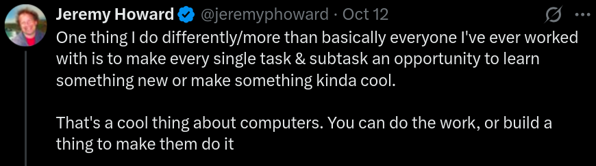

### What Level of Commitment Does fastai Need ?

I am actually quite overwhelmed by the content of Fastai course. How can I improve my understanding about what is happening and what will happen ?

::: {.callout-tip appearance="simple"}

- No rush, just step by step get into every formula and every concept used.

- Slow down to a comfortable pace and make sure you understand key ideas before moving on to more complex ideas.

- Most of these ideas have taken years, even decades to come together. So, don’t sweat it, if you don’t get all of it right away within a 3 hour lecture. (I for one, surely don’t.)

- The lectures, notebooks, papers etc. are available for free, so take your time and read the papers, rewatch the lectures, search for more info online, hand-on practice/experiments etc. until the ‘big picture understanding’ emerges.

:::

::: {.callout-important appearance="minimal" collapse="false"}

## Jeremy's reply

- It took me months to create this notebook. Not months of progress, but months of continuous failure. The difference between those who succeed
and those who don’t are — the ones that succeed didn’t give up! 🙂

- Part of confidence is failing - A lot. (99% of the time the code doesn’t work but after a while, you’re sure of what works and what doesn’t and understand the concept well.)

- Also, I spend at least 50% of every day learning and/or practicing new things, and have done so since I made that commitment at the age of 18.

- I don’t watch TV or play computer games or get lost in social media so I maximize the time I spend on things I care about.
So over time I’ve gotten faster at doing stuff, since I’ve been practicing and learning lots.

- One of our MOOC students, Louis Monier, is known as the “father of internet search” - he was the CTO of the first big web search company (Alta Vista). He’s a pretty smart guy! He told me he had watched the part 1 (2017) videos so many times that he knew much of them off by heart. He also practiced on a home deep learning project whilst watching the videos, and IIRC he spent something like 6 months working on that. If Louis needs to study this much, then the rest of us should probably expect to work even harder if we want to master the material. Today, Louis is the head of the AI Lab at AirBnB. So I guess the hard work can pay off… 😉

:::

::: {.callout-note appearance="minimal" collapse="false"}

## Radek's reply

- **When a true master of a discipline performs an action, it seems effortless.**

    > Consider great pianists - oh! how easy it seems to just sit in front of a piano, close your eyes, sway a bit and the music just flows. But then we go home and it doesn’t seem to be that easy.

- Same with watching Jeremy. We see those outstanding notebooks incorporating research findings from many, many years and we think: *‘oh, this is cool and Jeremy makes it seem simple, nice!’.*

- **What we don’t see is how much effort Jeremy (being an absolutely out of this world practitioner and teacher) put into creating the notebooks.**

    - I can only guess there have been a lot of `set_trace` calls involved and other development practices that we don’t see.

    - And it is not like Jeremy has been doing this for a couple of months nor that fastai is the first library that he authored.

- We see notebooks shared on the forums by students but we don’t see how much has been copied over nor how long it took us to piece things together.

- if you find this overwhelming you are not alone.

- I find that - **what works best for me is playing with toy problems.** If I can figure out how to train a fully connected network consisting of a layer or two on MNIST,
maybe I can figure out how to train a conv net. And from that maybe I can figure out how to create a resnet.

:::

### Schedule the course

- How long will u take to finish each lesson ?

- On which day will u watch the Lesson , what will u do after watching Lesson (next steps) etc. (to avoid procrastination & maintain consistency)

### Get started with coding

- Even if you are not good at coding -

    - Rather than thinking - it’s a shame “i don’t know coding”
    - Now you have a really fun project (fastai) - to learn coding for & from.
- Lots of people have become great coders while doing the course (Zach Mueller).
- You’ll learn lots of CS like -
    - OOPs, Functional programming
    - list comprehension
    - gpu acceleration, software design, etc.

### Don’t add too many fillers while doing the course

- If you start learning all the Pandas features…it will alone 6 months.

- There are so many different technologies being combined here. Jupyter, python, git, regular expressions, libraries like numpy, pandas…etc.

- **Make a big list of these things, decide how much time they’d take and how valuable they are (in order to prioritize) and then spend 10-20% of my time each week chipping away at them.**

- If I come across something in the course/notebooks that makes me feel like I need something more immediately, I prioritize that in my free study time for the week.

- Try to apply these newly learnt concept/skill everday.
    - Test it, apply it, discuss it , teach it, write blogs on it etc.
    - If doubt in using it, look up into docs.

### The hardest part of deep learning is artisanal

- How do you know if you’ve got enough data, whether it is in the right format, if your model is training properly, and, if it’s not, what you should do about it ? That is why we believe in - **learning by doing.**

- As with basic data science skills, **with deep learning you get better only through practical experience.** Trying to spend too much time on the theory can be counter-productive.

- **The key is to just code and try to solve problems**: the theory can come later, when you have context and motivation.

### Learning by Discovery (How to learn DL in Fastai way)

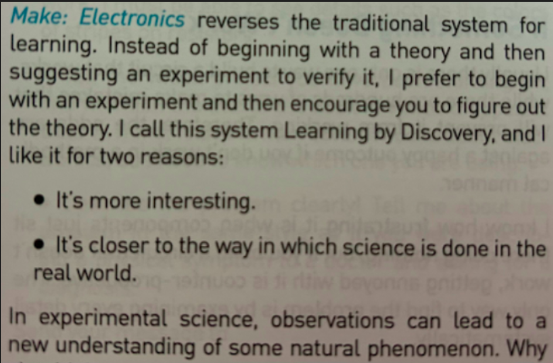{width=65%}

**In deep learning, it really helps if you have the motivation to fix your model to get it to do better. That’s when you start learning the relevant theory.**

- But you need to have the model in the first place. Learn almost everything through real examples.
- As we build out those examples, we go deeper and deeper, and we’ll show you how to make your projects better and better.
- This means that you’ll be gradually learning all the theoretical foundations you need, in context, in such a way that you’ll see why it matters and how it works.

### Don’t try to go in depth in Fastai library

::: {.callout-note appearance="minimal"}

Because, "**If you’ve finshed fastai part 1 + part 2 + fastbook + live coding + walk with fastai  – Then, you’d have implemented all the fastai library (from scratch + all the Deep learning fundamentals.)**"

:::

### There will be times when the journey feels hard.

- Times when you feel stuck. **Don’t give up!**

- Rewind through the book to find the last bit where you definitely weren’t stuck, and then read slowly through from there to find the first thing that isn’t clear.

- Then **try some code experiments yourself, and Google around for more tutorials** on whatever the issue you’re stuck with is—often you’ll find a different angle on the material that might help it to click.

- Also, **it’s expected and normal to not understand everything (especially the code) on first reading.**

- Trying to understand the material serially before proceeding can sometimes be hard.

- Sometimes things click into place after you get more context from parts down the road, from having a bigger picture.

- So if you do get stuck on a section, try moving on anyway and make a note to come back to it later.

### Tenacity and Deep Learning

::: {.callout-important appearance="minimal" collapsible=false}

- The story of deep learning is one of tenacity and grit by a handful of dedicated researchers. After early hopes (and hype!), neural networks went out of favor in the 1990s and 2000s, and just a handful of researchers kept trying to make them work well. Three of them, Yann Lecun, Yoshua Bengio, and Geoffrey Hinton, were awarded the highest honor in computer science, the Turing Award (generally considered the “Nobel Prize of computer science”), in 2018 after triumphing despite the deep skepticism and disinterest of the wider machine learning and statistics community.

- Hinton has told of how academic papers showing dramatically better results than anything previously published would be rejected by top journals and conferences, just because they used a neural network. Lecun’s work on convolutional neural networks, which we will study in the next section, showed that these models could read hand‐ written text—something that had never been achieved before. However, his break‐ through was ignored by most researchers, even as it was used commercially to read 10% of the checks in the US!

- In addition to these three Turing Award winners, many other researchers have battled to get us to where we are today. For instance, Jurgen Schmidhuber (who many believe should have shared in the Turing Award) pioneered many important ideas, including working with his student Sepp Hochreiter on the long short-term memory (LSTM) architecture (widely used for speech recognition and other text modeling tasks, and used in the IMDb example in Chapter 1). Perhaps most important of all, Paul Werbos in 1974 invented backpropagation for neural networks, the technique shown in this chapter and used universally for training neural networks (Werbos 1994). His devel‐ opment was almost entirely ignored for decades, but today it is considered the most important foundation of modern AI.

**There is a lesson here for all of us -**

**On your deep learning journey, you will face many obstacles, both technical and (even more difficult) posed by people around you who don’t believe you’ll be successful. There’s one guaranteed way to fail, and that’s to stop trying. We’ve seen that the only consistent trait among every fast.ai student who’s gone on to be a world-class practitioner is that they are all very tenacious.**

:::

### To become a world class DL Practitioner ( You need - )

- Willingness to learn
- Curiousity
- Tenacity
- Consistency (10,000 hrs)

**Being tenacious also means...**

- Keep going until u finish the Fastai course part 1 & 2.

- Keep coming back & continue the Fastai Lessons (even if u took a break of 2-3 days or 2-3 years)

### How to study Maths needed to understand DL papers ?

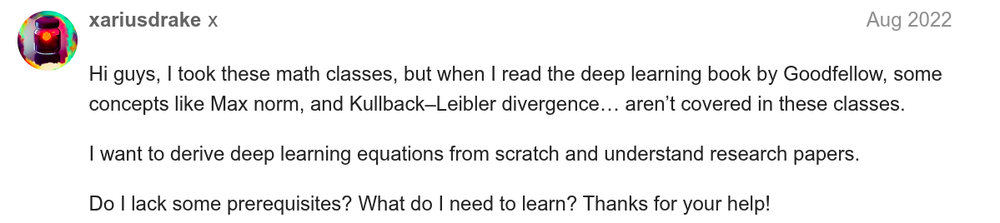

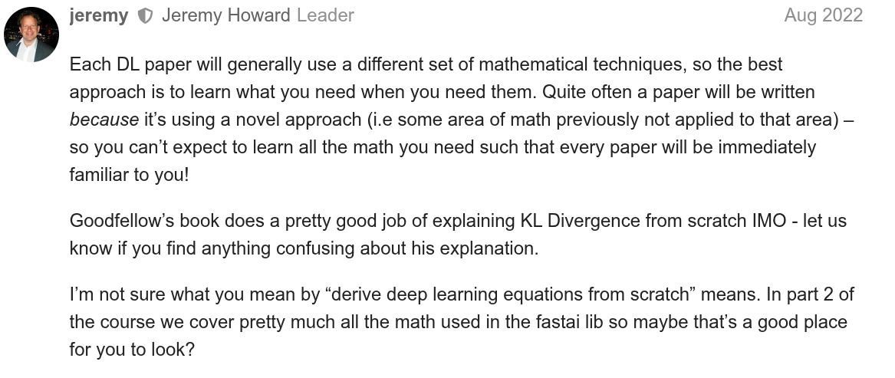

> If you find you need to know some foundational skill, learn it when needed , and just what you need. A lot of students get lost in rabbit holes of foundational math study and never develop expertise in AI/ML as a result!

### Doing an Actual Project by using something new.

- I have a project to build , how can i use a new method, new library, new knowledge, new way to complete this project, automating something in the project , making it less complex etc.

### Deliberate practice

- 10,000 hours of Deliberate practice makes you Expert.
- Deliberate practice involves Continuously taking effective feedbacks. eg :
    - **Learn a Lesson from Fastai and take a Kaggle competition based on the lesson.** It will give you feedback on learning.
    - **Building something from scratch & putting it out in world** and taking effective feedbacks from people.

### Learning compunds over time.

- Skills > built on skills > built on skills…makes you an expert.

### Stay Engaged

- Don’t focus on the perfect learning thing.
- Focus on things that keeps you engaged.

### Is spaced repetition useful for technical concepts/skills ?

- Instead; Try to apply newly learnt concept/skill everday.
- Test it, apply it, discuss it , teach it, write blogs on it etc.
- If doubt in using it, look up into docs.

### Creativity, Work-ethics, Problem-Solving Creation

- **Inspiration is for amateurs** — the rest of us just show up and get to work. And the belief that things will grow out of the activity itself and that you will — through work — bump into other possibilities and kick open other doors that you would never have dreamt of if you were just sitting around looking for a great ‘art idea.’ And the belief that process, in a sense, is liberating and that you don’t have to reinvent the wheel every day. Today, you know what you’ll do, you could be doing what you were doing yesterday, and tomorrow you are gonna do what you did today, and at least for a certain period of time you can just work. If you hang in there, you will get somewhere.

- **Problem Solving vs Problem Creation** : I think our whole society is much too problem-solving oriented. It is far more interesting to participate in ‘problem creation’ … You know, ask yourself an interesting enough question and your attempt to find a tailor-made solution to that question will push you to a place where, pretty soon, you’ll find yourself all by your lonesome — which I think is a more interesting place to be.

### You don’t need a Masters/PHD to succeed at deep learning

- Many important breakthroughs are made in research and industry by folks without a PhD, such as the paper “Unsupervised Representation Learning with Deep Convolutional Generative Adversarial Networks”—one of the most influential papers of the last decade, with over 5,000 citations — which was written by **Alec Radford** (a CS undergrad).

- What you will need to do to succeed, however, is to apply what you learn in this Fastai course & book to a personal project, and always persevere.

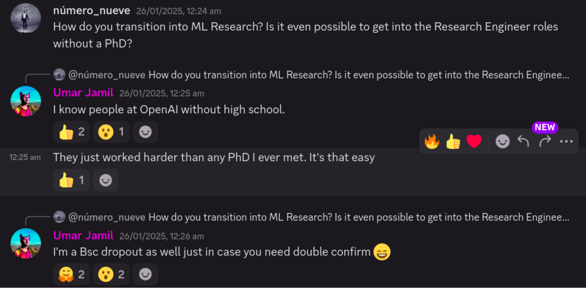

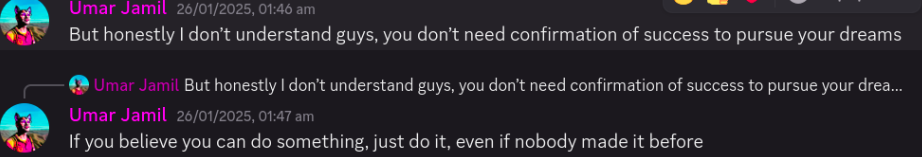

## Things Jeremy Says to do , in fastai lesson 1-12

::: {.callout-note appearance="minimal" collapse="false"}

## Listen to Jeremy  *`~ Radek`*

- **I mean like really listen, to everything  and spend your time how he suggests”. If he says, go code — do it. If he says “try blah”… go try blah.**

- Most consistent regret: “I should have listened when Jeremy said don’t spend hours lost in theory trying to understand everything right away”.

:::

### Lesson 1
- Don’t try to stop and understand everything.
- Don’t waste your time, learn Jupyter keyboard shortcuts. Learn 4 to 5 each day.
- Please run the code, really run the code. Don’t go deep on theory. Play with the code, see what goes in and what comes out.
- Pick one project. Do it really well. Make it fantastic.
- Run this notebook (lesson1-pets.ipynb), but then get your own dataset and run it! (extra emphasis: do this!)
- If you have a lot of categories, don’t run confusion matrix, run >> `interp.most_confused(min_val=n)`

### Lesson 2

- If forum posts are overwhelming, click “summarize this topic” at the bottom of the first post.
- It’s okay to feel intimidated, there’s a lot, but just pick one piece and dig into it. Try to push a piece of code, or learn a concept like regular expressions, or create a classifier, or whatever.
- If you’re struck, keep going.
- If you’re not sure which learning rate is best from plot, try both and see.
- When you put a model into production, you probably want to use CPU for inference, except at massive scale. Context: [Lesson 2: Putting Model into Production 50](https://youtu.be/ccMHJeQU4Qw?t=2308)
- Most organizations spend too much time gathering data. Get a small amount first, see how it goes.

### Lesson 3

- If you use a dataset, it would be very nice of you to cite the creator and thank them for their dataset.
- This week, see if you can come up with a problem that you would like to solve that is either multi-label classification or image regression or image segmentation or something like that and see if you can solve that problem. Context: [Fast.ai Lesson 3 Homework 115](https://youtu.be/MpZxV6DVsmM?t=7409)
- Always use the same stats that the model was trained with. Context: [Lesson 3: Normalized data and ImageNet 22](https://youtu.be/MpZxV6DVsmM?t=6413)
- In response to “Is there a reason you shouldn’t deliberately make lots of smaller datasets to step up from in tuning, let’s say 64x64 to 128x128 to 256x256?”: Yes you should totally do that, it works great, try it! Context: [Lesson 3: 64x64 vs 128x128 vs 256x256 50](https://youtu.be/MpZxV6DVsmM?t=4252)

### Lesson 4

- If you’re doing NLP stuff, make sure you use all of the text you have (including unlabeled validation set) to train your model, because there’s no reason not to. [Lesson 4: A little NLP trick 60](https://youtu.be/9YK6AnqpuEA?t=1256)

- In response to “What are the 10% of cases where you would not use neural nets”. You may as well try both. Try a random forest and try a neural net. [Lesson 4: How to know when to use neural nets 48](https://youtu.be/9YK6AnqpuEA?t=2440)

- Use these terms (parameters, layers, activations…etc) and use them accurately. [Lesson 4: Important vocabulary for talking about ML 44](https://youtu.be/9YK6AnqpuEA?t=6015)

### Lesson 5

- The answer to the question “Should I try blah?” is to try blah and see, that’s how you become a good practitioner. [Lesson 5: Should I try blah?](https://youtu.be/CJKnDu2dxOE?t=2800)

- If you want to play around, try to create your own nn.linear class. You could create something called My_Linear and it will take you, depending on your PyTorch experience, an hour or two. We don’t want any of this to be magic and you know everything necessary to create this now.

- These are the things you should be doing for assignments this week, not so much new applications but trying to write more of these things from scratch and get them to work. Learn how to debug them and check them to see what’s going in and coming out. [Lesson 5 Assignment: Create your own version of nn.linear 18](https://youtu.be/CJKnDu2dxOE?t=5431)

- A great assignment would be to take Lesson 2 SGD and try to add momentum to it. Or even the new notebook we have for MNIST, get rid of the Optim.SGD and write your own update function with momentum [Lesson 5: Another suggested assignment 14](https://youtu.be/CJKnDu2dxOE?t=6792)

### Lesson 6

- Not an explicit “do this” but it feels like it fits here. “One of the big opportunities for research is to figure out how to do data augmentation for different domains. Almost nobody is looking at that and to me it is one of the biggest opportunities that could let you decrease data requirements by 5-10x.” [Lesson 6: Data augmentation on inputs that aren’t images](https://youtu.be/hkBa9pU-H48?t=3852)

- If you take your time going through the convolution kernel section and the heatmap section of this notebook, running those lines of code and changing them around a bit. The most important thing to remember is shape (rank and dimensions of tensor). Try to think “why?”. Try going back to the printout of the summary, the list of the actual layers, the picture we drew and think about what’s going on. [Lesson 6: Go through the convolution kernel and heatmap notebook](https://youtu.be/hkBa9pU-H48?t=6486)

### Lesson 7

- Don’t let this lesson intimidate you. It’s meant to be intense in order to give you ideas to keep you busy before part two comes out.

- Go back and watch the videos again. There will be bits where you now understand stuff you didn’t before.

- Write code and put it on GitHub. It doesn’t matter if it’s great code or not, writing it and sharing it is enough. You’ll get feedback from your peers that will help you improve.

- It’s a good time to start reading some of the papers introduced in the course. All the parts that say derivations/theorems/lemmas, feel free to skip, they will add nothing to your understanding of practical deep learning. Read the parts where they talk about why they are solving this problem and the results. Write summaries that will explain this to you of 6 months ago.

- Perhaps the most important is to get together with others. Learning works a lot better if you have that social experience. Start a book club, a study group, get involved in meetups, and build things. It doesn’t have to be amazing. Build something that will make the world slightly better, or will be slightly delightful to your two year old to see it. Just finish something, and then try to make it a bit better. Or get involved with fast.ai and helping develop the code and documentation.

::: {.callout-note appearance="minimal" collapse="false"}

## [Lesson 7: What to do once you’ve completed Part 1 ?](https://youtu.be/9spwoDYwW_I?t=7777)

- Just code. Just code all the time.
- Look at the shape of your inputs and outputs and make sure you know how to grab a mini-batch.
- There’s so much material that we’ve covered, if you can get to a pointwhere you can rebuild those notebooks from scratch without cheating too much, you’ll be in the top echelon of practitioners and you’ll be able to do all of these things yourself and that’s really really rare.

:::

### Lesson 8 (part 2, 2019)

- The cutting edge of deep learning is really about engineering, not about papers. The difference between really effective people in deep learning and the rest is really about who can make things in code that work properly and there’s very few of those people. [The Cutting Edge](https://youtu.be/4u8FxNEDUeg?t=257)

-  There are many opportunities for you in this class. Experiment lots, particularly in your domain area. Write stuff down for the you of six months ago, that’s your audience. It doesn’t have to be perfect. [The Opportunities are Much Greater Now](https://youtu.be/4u8FxNEDUeg?t=1135)

- If you don’t understand something from Part 1, go back and watch the video about that thing. Don’t just keep blasting forwards. Especially the later lessons of Part 1 where we went into more detail. [It’s Assumed You Understand Part 1](https://youtu.be/4u8FxNEDUeg?t=1183)

- Overfit -> Reduce Overfitting -> There is no step 3. Remember overfitting doesn’t mean having a lower training loss than validation loss, that is normal. It means you have seen your validation error getting worse, until you see that happening you’re not overfitting. [3 Steps to Training a Really Good Model](https://youtu.be/4u8FxNEDUeg?t=1267)

- Learn to pronounce Greek letters. A big part of reading papers is getting past the fear of Greek letters. It’s very hard to read something you can’t pronounce. You’re saying to yourself "squiggle bracket 1+squiggle G squiggle 1-squiggle. [Time to Start Reading Papers](https://youtu.be/4u8FxNEDUeg?t=1391)

- Get very used to…

    - PyTorch tensors
    - ‘.view()’, this is how we reshape vectors (e.g from 784 -> 28*28)
    - Matrix multiplications - [Resource for Visualizing Matrix Multiplication](http://matrixmultiplication.xyz/)
    - This equation `c[i,j] += a[i,k] * b[k,j]` [Equation Context](https://youtu.be/4u8FxNEDUeg?t=2470)

- Homework: Take our most mind-bending broadcast and convince yourself of why it works. Put it in Excel, or do it on paper if it’s not already clear to you why this works. [Mind Bending Broadcast](https://youtu.be/4u8FxNEDUeg?t=3921)

- Apply the simple broadcasting rules when working with higher ranked tensors. Don’t try to keep it all in your head. (rules are listed in notebook) [Apply the Broadcasting Rules](https://youtu.be/4u8FxNEDUeg?t=3983)

- Always make sure your validation and training set were normalized in the same way.

- Reading papers from competition winners is a very very good idea. [Normal Papers vs Competition Papers](https://youtu.be/4u8FxNEDUeg?t=5532)

- More Homework: Go read section 2.2 of the [Resnet Paper](https://arxiv.org/abs/1502.01852)

- When you’re writing your own code, put some comments in your code to let the next person know what the hell you’re doing. [Jeremy Finds Undocumented Suboptimal Constant in PyTorch](https://youtu.be/4u8FxNEDUeg?t=6232)

- More Homework: If you don’t remember the chain rule, go to Khan Academy, they have a [great tutorial on the chain rule](https://www.khanacademy.org/math/ap-calculus-ab/ab-differentiation-2-new#ab-3-1a)

### Lesson 9
- When you see something in a library, don’t assume that it’s right or that it makes sense. When it comes to deep learning, none of us know what we’re doing. It doesn’t take too much to dig into it yourself. [Lesson 9: Don’t assume libraries are correct](https://youtu.be/AcA8HAYh7IE?t=1387)

- I dont set a random seed, this is very intentional because I want to see variation in my model, I don’t want it to be hidden away behind a fixed seed. [Lesson 9: When not to use a seed](https://youtu.be/AcA8HAYh7IE?t=3493)

- Coroutines in python are worth looking up and learning about, we’ll be using them lots.

- You can and should schedule everything, your dropout amount, what kind of data augmentation you do, weight decay, learning rate, momentum, everything. It’s very unlikely you would want the same hyperparameters throughout. [Lesson 9: Hyperparameter Scheduling](https://youtu.be/AcA8HAYh7IE?t=7225)

### Lesson 10

- I want to remind you that it’s totally okay if you’re not keeping up with everything, I’m trying to give you enough to keep you busy until Part 2 next year, but don’t feel like you need to understand everything within a week of first hearing it. [Lesson 10: Don’t worry](https://youtu.be/HR0lt1hlR6U?t=21)
    - **Reminder:** This was also [advice from Part 1 Lesson 2](https://youtu.be/ccMHJeQU4Qw?t=637). If you’re here you got through that and you’ll get through this too!

- What will tend to happen with stuff in fast.ai is that we’ll start with something trivially easy and at some point in the next hour or two you might reach a point where you’re feeling totally lost,
    - the trick is to go back to the point where it was trivially easy and figure out the bit where you suddenly noticed you were totally lost and find the bit in the middle where you kind of missed a bit because we are going to keep building up from trivially easy stuff. [Lesson 10: Where’d you get lost?](https://youtu.be/HR0lt1hlR6U?t=767)

- Dunder methods, there’s a particular list I suggest you know, and this is the list: [Lesson 10: Dunder Methods](https://www.youtube.com/watch?v=HR0lt1hlR6U&feature=youtu.be&t=1721)

  - `__getitem__`

  - `__getattr__`

  - `__setattr__`

  - `__del__`

  - `__init__`

  - `__new__`

  - `__enter__`

  - `__exit__`

  - `__len__`

  - `__repr__`

  - `__str__`

- You need to be really good at browsing source code. This is a list of things you should know how to do in your editor of choice: [Lesson 10: What an editor needs](https://www.youtube.com/watch?v=HR0lt1hlR6U&feature=youtu.be&t=1790)

  - Jump to tag/symbol by with(with completions)
  - Jump to current tag
  - Jump to library tags
  - Go back
  - Search
  - Outlining/folding

- Standard deviation is more sensitive to outliers than mean absolute deviation. For that reason the mean absolute deviation is very often the thing you want to be using because, in ML, outliers are often more of a problem than a help. Mean absolute deviation is really underused, you should get used to it. [Lesson 10: Mean absolute deviation](https://www.youtube.com/watch?v=HR0lt1hlR6U&feature=youtu.be&t=2257)

- Replacing things involving squares with things that use absolute values often works better. It’s a good tip to remember. [Lesson 10: Squares are for squares](https://www.youtube.com/watch?v=HR0lt1hlR6U&feature=youtu.be&t=2323)

- From now on, you’re not allowed to look at an equation, or type it in LaTeX without also typing it in python, actually calculating some values, and plotting it, because this is the only way we get a sense of what these variables and equations actually mean. [Lesson 10: Always play with equations](https://www.youtube.com/watch?v=HR0lt1hlR6U&feature=youtu.be&t=2574)

- Your problem to play with during the week is "how accurate can you make a model just using the layers we’ve created so far, and, for the ones that are great accuracy, what does the telemetry look like? How can you tell it’s going to be good? And then what insights can
    - you gain from that to make it even better? Try to beat me (0.9898 at best point, 0.9822 at end) You can beat it pretty easily with some playing around, but do some experiments. [Lesson 10: Toy Problem #1 (**Homework**)](https://www.youtube.com/watch?v=HR0lt1hlR6U&feature=youtu.be&t=5819) 

- Epsilon appears in lots of places in deep learning and is a fantastic hyperparameter that you should be using to train things better [Lesson 10: More about epsilon](https://www.youtube.com/watch?v=HR0lt1hlR6U&feature=youtu.be&t=7369)

- It’s really good to create interesting little games to play, in research we call them toy problems. Almost everything in research is toy problems you come up with and try to find solutions to. Another toy problem to try during the week is, what’s the best accuracy you can get in a single epoch using whatever normalization you like and only architectures we’ve used up to lesson 7? [Lesson 10: Toy Problem #2 (**Homework**)](https://www.youtube.com/watch?v=HR0lt1hlR6U&feature=youtu.be&t=8071)

### Lesson 11

- A big part of getting good at deep learning in your domain is knowing how to create small workable useful datasets. In your domain area, whether it’s audio or sanskrit texts, try to come up with a toy problem or two which you hope might give insight into your full problem. [Lesson 11: Small useful datasets](https://youtu.be/hPQKzsjTyyQ?t=849)

- If you haven’t seen `compose` used in programming before, google it. It’s a super useful concept and it comes up all the time. [Lesson 11: Compose](https://youtu.be/hPQKzsjTyyQ?t=1881) 

- A great opportunity to contribute is using telemetry to view activations of different layers and seeing what happens experimentally. The theory people generally don’t know how to train models, and the practitioners forget about actually thinking about the foundations at all, but if you can combine the two and try some experiments to see what happens when you adjust weight decay, you can find some really interesting results. [Lesson 11: Another opportunity](https://youtu.be/hPQKzsjTyyQ?t=5449)

- The trick to making Adam and Adam-like things work well is to make epsilon 0.1 (or between 1e-3 and 1e-1). Most people use 1e-7 and that’s never going to be a good idea.
    - [Lesson 11: Another place where epsilon matters](https://youtu.be/hPQKzsjTyyQ?t=6212)

- When you’re augmenting your data, look at or listen to your augmented data. Don’t just chuck it in a model but look at the augmented output and try to find something to study to see if you’re losing information. [Lesson 11: Mindful data augmentation](https://youtu.be/hPQKzsjTyyQ?t=6965)

- Image augmentation isn’t just about throwing some transformation functions in there, but think about when you’re going to do it because you have this pipeline where you start with bytes, which become floats. Think about where you’re gonna do the work. Do whatever you can while they’re still bytes, but be careful to not do anything that will cause rounding errors or saturation problems. [Lesson 11: Optimizing data augmentation](https://youtu.be/hPQKzsjTyyQ?t=7131)

- When doing data augmentation on non-images, ask yourself what kind of changes could occur in data that wouldn’t cause the label to change but would still leave that data as a reasonable example that could show up in your dataset. [Lesson 11: Data augmentation in other domains](https://youtu.be/hPQKzsjTyyQ?t=7363)

### Lesson 12

- Be careful about using automated formatting and creating too many rules. Sometimes unconventional formatting can help you to understand your code better. This is the only way to make your code work. Debugging machine learning code is awful so you have to make sure the thing you write makes sense and is simple. [Lesson 12: Unconventional Formatting](https://youtu.be/vnOpEwmtFJ8?t=147)

- The mixup paper is a pretty easy read by paper standards. I suggest you [check it out.](https://arxiv.org/abs/1710.09412)

- Make your equations in code as close as possible to the paper you’re implementing. When you’re comparing something to a paper, you want something that you can look at and straightaway say “oh, that looks very familiar”. As long as it’s not familiar you may want to think about how to make it more familiar. [Lesson 12: When to use Greek Letters](https://youtu.be/vnOpEwmtFJ8?t=674)

- Don’t listen to people in your organization saying we can’t start modeling until we do all this cleanup work. Start modeling right now, see if the results are okay, and if they are, maybe you can skip the cleanup or do them both simultaneously.

- Read the [Bag of Tricks Paper](https://arxiv.org/abs/1812.01187) and think about for each of those resnet tweaks, why did they do that? It wasn’t some brainless random search where they tried everything. They sat back and thought “how do we use all the inputs we have and take advantage of all the computation we are doing?” Spend time thinking about architectures and experimenting with them, it’s really important for effective practitioners to be able to write nice concise architectures so that you can change them and understand them. [Lesson 12: Build Architectures Thoughtfully](https://youtu.be/vnOpEwmtFJ8?t=2350)

- A super important thing to remember if you’re doing fine-tuning is don’t ever freeze the weights in the batchnorm layers if you’re ever doing partial layer training. [Lesson 12: Batchnorm Does Weird Things](https://youtu.be/vnOpEwmtFJ8?t=3762)

- The way to debug in DL is to not make mistakes in the first place. The only way to do that is to make your code so simple that it can’t have a mistake, and to check every single intermediate result along the way. You also need to be a great scientist, which means keeping a journal notebook to keep track of your results. [Lesson 12: A War Story About DL Debugging](https://youtu.be/vnOpEwmtFJ8?t=4177) (really long and detailed response that’s worth a second listen)

- When preprocessing data for neural nets, leave it as raw as you can is the rule of thumb.

## How to get most out of Fastai courses

- Approaching each lesson slowly, and letting myself wander in the related concepts, learning as much as I could through online communities.
- What is CV? There’s this cool new model out, how would I use it in fastai? My first ever question on the fastai forums was even about debugging a model. But the key here is I didn’t rush things.
- I see far too often people give up and ask for help a day or so into a problem. When I started out, I didn’t ask for help about a week into it. And that’s because I was actively Googling the problem and any relation I could find on it. Not just limiting it to a fastai issue.
- Everyone wants to get there the fastest. And while yes you can, this is often met with others simply handing out the answers, and you not really “learning”. And what winds up happening is the same question gets asked again and again, because they didn’t take a step back and Explore the problem fully and find the root of the issue, or learn a concept that directly relates to it. I purposefully do not do this when someone asks for help, as it can hinder them long-term.
- Through attacking these problems and learning the fastai framework, I learned how to debug Python, how to work with PyTorch a little bit, and new concepts I had seen for the first time.
- Take it slow, at your own pace. Debug things yourself and get good at standing on your own two feet. At a job, that’s what your life will be like.
- _This is simply what helped me when I was starting:_

	- Taking it seriously, from the start
	- Coming in with a curious mind
	- Driven to see it through

- **Go through the lectures and courses slowly, relistening and running the notebooks _often_ .**
- **Essentially go through the notebooks and explore why what is doing what, play around with problem sets, and keep looking back at the original notebooks until it becomes fluid.**

## Strategies to browse through the fastai code?

**Jeremy’s Reply**

- I’d recommend finishing reading the book before diving too far into the library code, because in the book you’ll recreate many of the key classes in fastai from scratch.
- Once you’ve done that the fastai code will make much more sense since you’ll know what each bit is doing.

**Zach's Reply**

- Finish Walk with Fastai courses - to understand Fastai library code + to transition to use Pytorch+fastai (best of both worlds)
- A list of the best fast.ai resources, in no particular order, with descriptions and how I utilize them 🙂
- [docs.fastai.ai](https://docs.fast.ai/) paired with their [source notebooks](https://github.com/fastai/fastai/tree/master/nbs)

- Looking from documentation to examples right away, and letting yourself get your hands dirty. The most common notebooks I go back to ->

- [DataBlock:](https://docs.fast.ai/tutorial.datablock.html) Shows a variety of ways to create @fastdotai DataBlock and DataLoaders with the midlevel API
- [Callback (Core):](https://docs.fast.ai/callback.core.html) Remembering the event trigger names, how they work, and quick links to other examples.
- And [Learner](https://docs.fast.ai/learner.html), as that’s the basics of everything @fastdotai trains with.

- We can’t forget the [fastai forums !](https://forums.fast.ai/) Easily my one-stop-shop if I ever have a question about _anything_ in fastai. Even if it’s just for a casual stroll through the forums, there is something available in there for everyone to learn with a welcoming community!

- Then of course [Nbdev](https://nbdev.fast.ai/) ; Coupled with [Fastcore](https://fastcore.fast.ai/)
	- Trailing back and forth between the two as I look into and use nbdev let’s me quickly see how fastai’s (suite) “magic” functions work, and let’s me learn how to utilize them more

- Then we have @amaarora’s timmdocs, an additional documentation to @wightmanr’s timm library that he’s been doing an _excellent_ job on: [timm.fast.ai](https://timm.fast.ai/)

- Finally, we have my walkwithfastai [Walk with Fastai](https://walkwithfastai.com/revisited/) which consists of numerous other tutorials and different DataBlock methods that aren’t shown in the fastai documentation, and also contains my API-forward approach towards teaching @fastdotai.

## How to contribute to Fastai library + prepare for fastai Part 2 course

- If you have absolutely zero, I recommend watching the first few lectures in the latest part 2 . Since it’s building a library from scratch, Jeremy covers how he approaches software design, which can help you understand the design.
- From there, start small. Look at the simpler areas of the library, and try and add some documentation, etc. Then slowly build yourself towards not understanding how fastai works, but how the DESIGN process works. Apply yourself towards seeing how classes interact, etc.
- A little toying goes a long way. After getting comfortable in some specific area, try writing some newer functions, or perhaps try to fix a bug that got noticed. It will be challenging, and you probably will struggle a bit. It’s not easy and that’s okay. Why?

- With the discord, forums, and twitter combined, you can find someone (or many someones) to help you understand how to get from A -> B, and that’s what’s wonderful about this community!

- To take that further, if the part 2 videos are still too high a level, try finding some educational tutorials and courses on Object Oriented Programming, and try and bring up your foundations (pun intended).
