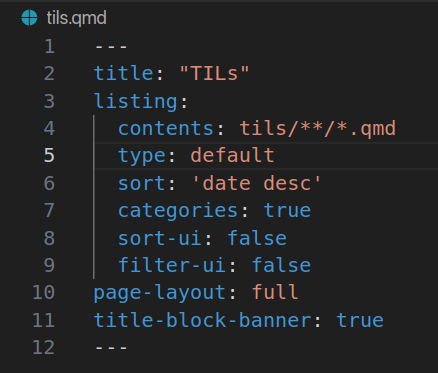
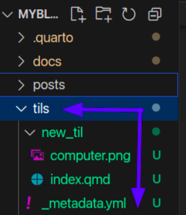
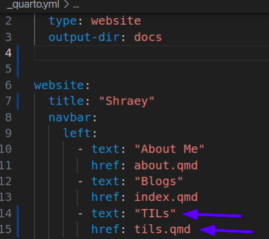

## How to use callouts

::: {.callout-note}
Note that there are five types of callouts, including:
`note`, `warning`, `important`, `tip`, and `caution`.
:::

::: {.callout-tip}
## Tip with Title

This is an example of a callout with a title.
:::

::: {.callout-caution collapse="true"}
## Expand To Learn About Collapse

This is an example of a 'folded' caution callout that can be expanded by the user. You can use `collapse="true"` to collapse it by default or `collapse="false"` to make a collapsible callout that is expanded by default.
:::

---

::: {.callout-note appearance="default"}

## default

The default appearance with colored header and an icon.

:::

::: {.callout-note appearance="simple"}

## simple

A lighter weight appearance that doesn’t include a colored header background.

:::

::: {.callout-note appearance="minimal"}

## minimal

A minimal treatment that applies borders to the callout, but doesn’t include a header background color or icon.

:::

## How to Create a Custom Section in Quarto

> How to create custom blog sections in quarto blogsite (eg: TILs )

-   Create `tils.qmd` in root directory of quarto project
    -   
-   Create a tils folder in root directory
    -   Now you can add new TIL posts as sub-folders & .qmd files within them.
    -   
-   Update quarto yaml file
    -   
